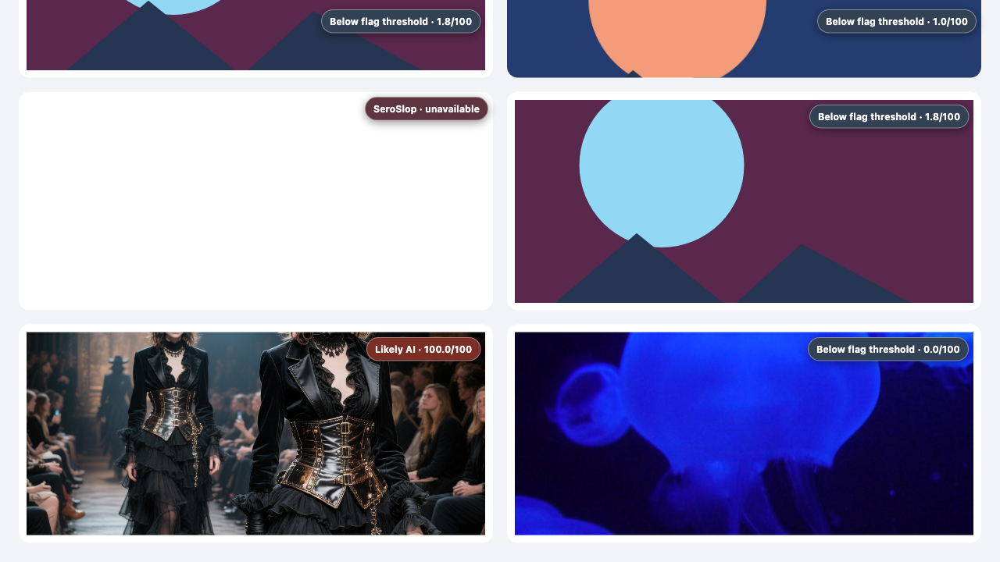
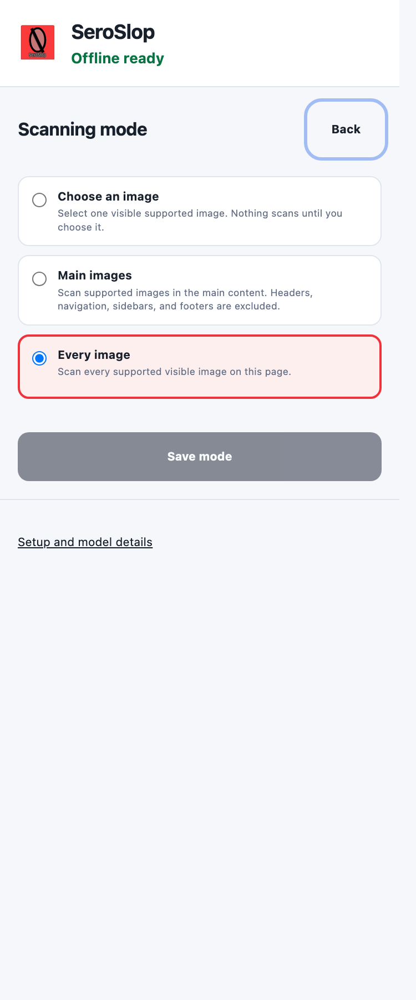

# SeroSlop

SeroSlop is a native Manifest V3 Chrome extension that shows a local AI-image model score beside images on ordinary webpages. It runs one packaged ONNX model inside the browser, without a detector API, localhost process, hash lookup, telemetry, or post-install model download.



Screenshot fixtures: [“Méduses, Oceanopolis, Brest”](https://www.flickr.com/photos/alainlm/3548073223/) by [alainlm](https://www.flickr.com/people/alainlm/), [CC BY 2.0](https://creativecommons.org/licenses/by/2.0/); synthetic fixture from [Qwen/Qwen-Image-Bench](https://huggingface.co/datasets/Qwen/Qwen-Image-Bench), Apache-2.0. The screenshot demonstrates the interface, not model accuracy.

The fixed decision rule is inclusive: **AI score ≥ 65.0/100 is flagged**. Every completed analysis shows a numeric model score; failures say **unavailable** instead of inventing one. The score is not a calibrated probability, and a badge is not proof of origin or authenticity. Historical repository paths and evidence identifiers retain `prooflens` so prior model and evaluation receipts remain reproducible; the installed extension and user-visible interface are SeroSlop.

<!-- PROOFLENS_CURRENT_M2_START -->
## Current M2 model

The shipped classifier keeps the Community Forensics ViT-S/16 backbone frozen and replaces only its 384-to-1 head. The upstream backbone was trained on 5.4 million real/synthetic examples spanning 4,803 generators. SeroSlop trained the M2 head on **105,978 public images**: 51,200 synthetic and 54,778 non-AI. The 2,378-image StockImages-CC0 addition targets the ordinary-photo false positives found by the consumed replacement-v2 evaluation. Fresh extraction covered all 123,912 feature views.

Independent ONNX comparison found exactly two changed initializers, `classifier.weight` and `classifier.bias`; the other 198 initializers and the graph contract are unchanged. The packaged model is 87,442,080 bytes with SHA-256 `a994b1bd4d0323909b2b308db848bf668fd00e2f02c8973ec546c400efe2dc47`.

The 900-image development validation produced 94.08% balanced accuracy on originals, 95.83% on screenshots, 93.67% on JPEG-75, and 94.25% on heavy double-JPEG. StockImages non-AI recall was 96%, 100%, 94%, and 98% across those views. These are model-selection results, not an untouched generalization estimate or a bounty score. The pixel-free training receipt, 54 fresh-feature shard digests, candidate grid, calibration, and classifier-only comparison are under `benchmark/evidence/m2/`.
<!-- PROOFLENS_CURRENT_M2_END -->

## Submission proxy

The packaged extension scored a fixed, score-blind panel of 600 reserved Met Open Access real images and 600 publisher-labeled TASTE synthetic images. TASTE contributed 150 images from each of four current generator groups. The run used a clean Chrome profile and put the browser offline before inference.

At the inclusive 65.0/100 threshold, balanced accuracy was **85.83%**: real-image recall was 77.67% and synthetic-image recall was 94.00% (TN 466, FP 134, TP 564, FN 36). Chrome used WebGPU for all 1,200 rows, and the run recorded no HTTP or HTTPS request after the offline cutoff.

This clears the bounty's 75% threshold on the public proxy. It does not predict or claim a score on the maintainer's private benchmark. The frozen panel, verified input hashes, predictions, result receipt, scored source commit, and public CI binding are under `benchmark/evidence/bounty-proxy-m2-v1/`.

## Historical evaluation evidence

The original 600-image Kling v2.1/Library of Congress holdout was run once and is consumed. Its stored predictions failed the frozen numeric contract before bootstrap: 2,231 of 2,400 probabilities did not equal the verifier’s binary64 sigmoid of their recorded logits within `2e-12`. The failure packet is permanently marked `acceptanceEligible: false`; its point estimates are diagnostic only. The model, calibration, threshold, preprocessing, acceptance gates, and extension runtime did not change in response.

The score-blind replacement packet was scored once from the public V3 freeze and is now consumed. Its 600-image confirmation passed every frozen accuracy gate: balanced accuracy was 89.67%–97.67%, and the lowest 95% balanced-accuracy bound was 87.17%. The separate 319-photo StockImages slice failed the stricter false-positive gate. Original photos had an 8.78% false-positive rate with a 12.39% Wilson upper bound; JPEG-75 photos had a 13.79% rate with an 18.01% upper bound. Both exceed the frozen 10% overall upper-bound limit, so the packet is permanently `acceptanceEligible: false`. It is development evidence only, not a release result. [BENCHMARK.md](BENCHMARK.md) records the complete packet, append-only lineage, and unchanged gates.

Public repository evidence does not establish the bounty maintainer’s private score, acceptance decision, or payment.

## Install SeroSlop

### Stable release

1. Download the latest `seroslop-*.zip` from [GitHub Releases](https://github.com/baney75/SeroSlop/releases/latest).
2. Unzip it to a folder you will keep.
3. In desktop Chrome 121 or newer, open `chrome://extensions` and turn on **Developer mode**.
4. Choose **Load unpacked**, then select the unzipped folder.
5. Leave the setup tab open until it says **Offline ready**, then choose a scanning mode.

Chrome on iPhone and Android cannot load unpacked extensions. A Chrome Web Store listing is being prepared but is not published yet.

### Nightly builds

[Nightly releases](https://github.com/baney75/SeroSlop/releases) contain the newest tested `main` build for developers. They may change between releases and must also be loaded unpacked. Stable and nightly GitHub builds do not update themselves: download the newer ZIP, replace the old folder, then choose **Reload** on `chrome://extensions`.

Chrome Web Store installations use Chrome's signed automatic update system after a listing is published. GitHub ZIPs deliberately do not imitate that mechanism. See Chrome's [extension update lifecycle](https://developer.chrome.com/docs/extensions/develop/concepts/extensions-update-lifecycle).



### Use it

The three modes are available after setup:

- **Choose an image** waits for you. Press the extension button and choose an image, or right-click an image and select **Analyze this image with SeroSlop**.
- **Main images** scans supported images in the main content, excluding headers, navigation, sidebars, and footers.
- **Every image** scans every supported visible image on the page.

Each result stays attached to the image it describes. A result is a model score, not proof of origin.

### Build from source

Requirements: Node.js 20.9 or newer, Python 3.10 or newer, `npm`, `zip`, and Chrome 121 or newer.

```bash
git clone https://github.com/baney75/SeroSlop.git && cd SeroSlop
python3 -m venv .verify-venv
source .verify-venv/bin/activate
python -m pip install -r benchmark/verify-requirements.txt
npm ci && npm run verify:static
```

Then load the generated build:

1. Open `chrome://extensions`, then enable **Developer mode** using the toggle in its upper-right corner.
2. Select **Load unpacked** and choose the generated `dist/` directory.
3. Keep the setup tab open until it says **Offline ready**. The model is already in the package; setup verifies its SHA-256 and prepares local storage.
4. Choose a scan mode. No mode is selected for you.
5. Open the extension to run the chosen action or choose **Change mode**. In image-picking mode, use the pointer or move with Tab, press Enter to analyze, and press Esc to cancel.

The reproducible archive is generated at `release/prooflens.zip`; its digest is recorded in `release/SHA256SUMS.txt`.

## Update a source build

Developer-loaded extensions do not update themselves. From the repository directory:

```bash
git pull --ff-only
npm ci
npm run build
```

Then open `chrome://extensions` and press **Reload** on SeroSlop. A future Chrome Web Store release can use Chrome's signed automatic update path; this source beta does not imitate that mechanism.

## Verify the release

```bash
python3 -m venv .verify-venv
source .verify-venv/bin/activate
python -m pip install -r benchmark/verify-requirements.txt
npm ci
npm run verify:static      # current M2 model, evidence, package, and lineage checks
npm run browser:install    # one-time project browser install
npm run test:chrome        # fresh profile, restart, forced WASM, offline/no-localhost E2E
npm run test:chrome:webgpu # same contract through WebGPU
```

Keep `.verify-venv` active for `verify:static`. The command detects the repository stage and, on the M2 publication, requires the exact public lineage, training packet, model lock, classifier-only comparison, deterministic package, and current documentation. GitHub Actions runs that pixel-free contract and the portable forced-WASM browser path. WebGPU remains a separate fixed-head local gate because hosted-runner GPU availability is not stable. The older `verify:release` script replays the consumed replacement-v2/M1 packet from its historical checkout; it is not an M2 acceptance test.

The browser test closes its fixture server and puts the browser offline before analysis. It verifies measurable setup progress, model persistence across a browser restart, zero post-cutoff network requests, confirmed control states (including injected failures), fresh re-scan work, dynamic and responsive images, one result for a rendered CSS composite, rejection of an in-flight stale CSS result, CSSOM-only background reconciliation, numeric labels, an explicit unavailable state, a closed/recoverable label boundary, bounded hostile-page work, cap-replacement recovery, and target-associated labels at a 480 px viewport with a 1.5× device scale. A chip that cannot be placed without covering another target is hidden instead of being detached from the image it describes; the popup still reports the result count. Release verification also rebuilds under New York and UTC time zones and requires byte-identical archives.

## Runtime design

```text
content script: discovers targets and creates local rendered-pixel or viewport-crop requests
  |
  v
MV3 service worker: rate-limits active-viewport capture when canvas pixels are unavailable,
bounds work, and restores the offscreen document
  |
  v
offscreen document: verifies model bytes, decodes and preprocesses the image,
then runs WebGPU or its clean WASM fallback and applies frozen calibration
  |
  v
content script: accepts only the matching request/source and renders a result
```

When canvas access permits, SeroSlop reduces images above a 1,024-pixel long edge and encodes the bounded pixels locally as lossless PNG. Otherwise, it captures the already-rendered active viewport locally and crops the target inside the offscreen document. Viewport capture is confirmed against the exact sending document ID and origin before and after Chrome's capture call. A page-controlled URL is never fetched by extension code, and extension-page CSP blocks remote connection/image beacons, so redirects, DNS rebinding, localhost, and private-network destinations are outside the acquisition path. Oversized sources, excessive decoded dimensions, corrupt model bytes, unsupported protocols, navigated/inactive-tab crops, and decode failures fail closed.

## Model lock

- Artifact: `weights/prooflens-cf384.onnx`
- Bytes: `87,442,080`
- SHA-256: `a994b1bd4d0323909b2b308db848bf668fd00e2f02c8973ec546c400efe2dc47`
- Input/output: `pixel_values [N,3,384,384]` to `logits [N,1]`
- Upstream corrected revision: `ac6ee457bea904a373065754107451793b56db00`
- License: MIT

The complete machine-readable contract is [model-lock.json](model-lock.json). Training replaces only the frozen backbone’s 384-to-1 classifier head; it does not add a second model or heuristic score.

## Documentation

- [BENCHMARK.md](BENCHMARK.md): evaluation protocol and evidence
- [MODEL_CARD.md](MODEL_CARD.md): provenance, preprocessing, calibration, and limitations
- [PRIVACY.md](PRIVACY.md): data flow and permission rationale
- [SECURITY.md](SECURITY.md): threat model and fail-closed controls
- [DESIGN.md](DESIGN.md): visible states, controls, accessibility, and responsive contract
- [docs/ACCEPTANCE.md](docs/ACCEPTANCE.md): bounty criteria mapped to executable proof
- [THIRD_PARTY_NOTICES.md](THIRD_PARTY_NOTICES.md): bundled runtime/model notices and training-data provenance

## Planned, not part of this submission

- [ ] False-positive and false-negative review workflow with user-provided evidence.
- [ ] Rights-reviewed, privacy-safe contributor intake after a separate product and legal decision.
- [ ] Review and deletion rules for any future training-data admission.

The contributor directory is retained as an internal development artifact. This submission does not upload images or admit contributor data into training.

SeroSlop is MIT licensed. Dataset pixels are not included in this repository.
