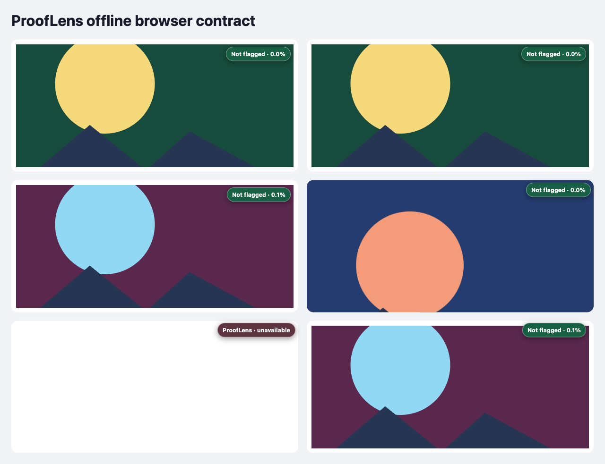

# ProofLens

ProofLens is a native Manifest V3 Chrome extension that estimates AI-image likelihood beside images on ordinary webpages. It runs one packaged ONNX model inside the browser, without a detector API, localhost process, hash lookup, telemetry, or post-install model download.



The fixed decision rule is inclusive: **AI likelihood ≥ 65.0% is flagged**. Every completed analysis shows a numeric confidence; failures say **unavailable** instead of inventing a score. A badge is an estimate, not proof of origin or authenticity.

## Results

The frozen 87.4 MB FP32 artifact scored **93.83% balanced accuracy** on the 600-image, sample-disjoint modern holdout at the displayed 65% cutoff. Its 95% stratified-bootstrap interval was **91.83–95.67%**. The lowest measured web-transformation result was **92.17%** after heavy double-JPEG compression.

| Holdout view | Balanced accuracy | Real recall | AI recall | 95% BA interval |
|---|---:|---:|---:|---:|
| Original | 93.83% | 92.67% | 95.00% | 91.83–95.67% |
| Social screenshot | 96.00% | 97.67% | 94.33% | 94.33–97.50% |
| JPEG 75 / resize | 92.67% | 92.67% | 92.67% | 90.50–94.67% |
| Heavy double-JPEG | 92.17% | 95.67% | 88.67% | 90.00–94.17% |

These are public, reproducible evaluation results; they are not the bounty maintainer’s private score. See [BENCHMARK.md](BENCHMARK.md) for split design, hashes, per-generator recall, confidence intervals, browser parity, and limitations.

## Install from source

Requirements: Node.js 20.9 or newer, `npm`, `zip`, and Chrome 121 or newer.

```bash
git clone https://github.com/baney75/prooflens.git && cd prooflens
npm ci && npm run verify
```

Then:

1. Open `chrome://extensions`, then enable **Developer mode** using the toggle in its upper-right corner.
2. Select **Load unpacked** and choose the generated `dist/` directory.
3. Keep the setup tab open until it says **Offline ready**. The model is already in the package; setup verifies its SHA-256 and prepares local storage.
4. Visit an ordinary webpage. ProofLens automatically queues visible ``, `picture`/`srcset`, dynamic images, and CSS `background-image` targets.

The reproducible archive is generated at `release/prooflens.zip`; its digest is recorded in `release/SHA256SUMS.txt`.

## Verify the release

```bash
npm ci
npm run verify             # lint, strict types, tests, model/benchmark integrity, build, package audit
npm run browser:install    # one-time project browser install
npm run test:chrome        # fresh profile, restart, forced WASM, offline/no-localhost E2E
npm run test:chrome:webgpu # same contract through WebGPU
```

The browser test closes its fixture server and puts the browser offline before analysis. It verifies model persistence across a browser restart, zero post-cutoff network requests, dynamic and responsive images, one result for a rendered CSS composite, rejection of an in-flight stale CSS result, CSSOM-only background reconciliation, numeric labels, an explicit unavailable state, a closed/recoverable label boundary, bounded hostile-page work, cap-replacement recovery, and a narrow viewport. Release verification also rebuilds under New York and UTC time zones and requires byte-identical archives.

## Runtime design

```text
content script: discovers targets and creates local rendered-pixel or viewport-crop requests
  |
  v
MV3 service worker: rate-limits active-viewport capture when canvas pixels are unavailable,
bounds work, and restores the offscreen document
  |
  v
offscreen document: verifies model bytes, decodes and preprocesses the image,
then runs WebGPU or its clean WASM fallback and applies frozen calibration
  |
  v
content script: accepts only the matching request/source and renders a result
```

Page pixels are snapshotted losslessly when canvas access permits. Otherwise, ProofLens captures the already-rendered active viewport locally and crops the target inside the offscreen document. A page-controlled URL is never fetched by extension code, so redirects, DNS rebinding, localhost, and private-network destinations are outside the acquisition path. Oversized sources, excessive decoded dimensions, corrupt model bytes, unsupported protocols, inactive-tab crops, and decode failures fail closed.

## Model lock

- Artifact: `weights/prooflens-cf384.onnx`
- Bytes: `87,442,080`
- SHA-256: `29545a1da0cfe2bf0149448334fd45a21f48074c57296db3b84437dd66f80a43`
- Input/output: `pixel_values [N,3,384,384]` to `logits [N,1]`
- Upstream corrected revision: `ac6ee457bea904a373065754107451793b56db00`
- License: MIT

The complete machine-readable contract is [model-lock.json](model-lock.json). Training replaces only the frozen backbone’s 384-to-1 classifier head; it does not add a second model or heuristic score.

## Documentation

- [BENCHMARK.md](BENCHMARK.md): evaluation protocol and evidence
- [MODEL_CARD.md](MODEL_CARD.md): provenance, preprocessing, calibration, and limitations
- [PRIVACY.md](PRIVACY.md): data flow and permission rationale
- [SECURITY.md](SECURITY.md): threat model and fail-closed controls
- [DESIGN.md](DESIGN.md): visible states, controls, accessibility, and responsive contract
- [docs/ACCEPTANCE.md](docs/ACCEPTANCE.md): bounty criteria mapped to executable proof
- [THIRD_PARTY_NOTICES.md](THIRD_PARTY_NOTICES.md): licenses and attribution shipped in every archive

ProofLens is MIT licensed. Dataset pixels are not included in this repository.
